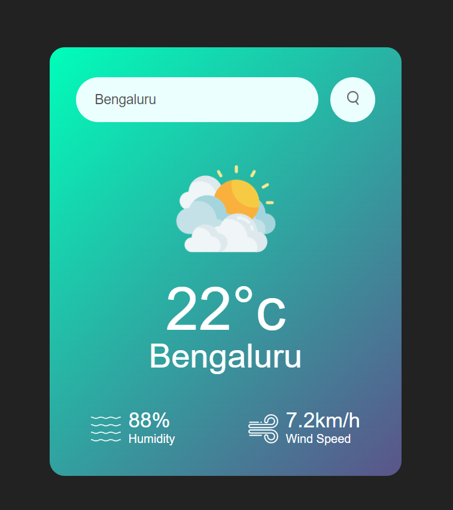

# Weather-App

## Description 

Introducing my weather app built in JavaScript! With data sourced from OpenWeatherMap, it provides real-time weather conditions for any city. Stay informed and plan your day accordingly with this reliable and user-friendly application.
## Authors

- [Mannath Shaik](https://www.github.com/mannath93478) 

## Demo

Live Demo:

   
## Getting Started

To explore or modify the code, follow these steps:

1.Clone the repository

2.Open the project in your preferred code editor.

3.Make changes to the HTML, CSS, or JavaScript files as desired.

4.Test the changes locally.

5.Deploy the updated website to your preferred hosting platform.

## Features

🌤️ 1.️ Real-time Weather Updates: Get instant access to up-to-date weather conditions for any city.

🌡️ 2.️ Temperature Display: View accurate temperature readings in Celsius or Fahrenheit.

🌧️ 3.️ Forecasting: Plan ahead with reliable weather forecasts for the upcoming days.

🌍 4.️ Global Coverage: Access weather information for cities worldwide.

🔍 5.️ Search Functionality: Easily search and find weather data for specific cities.

## 🔗 Links

For any questions or inquiries, please feel free to reach out. 

Mannath Shaik :

Thank you for visiting the page!
